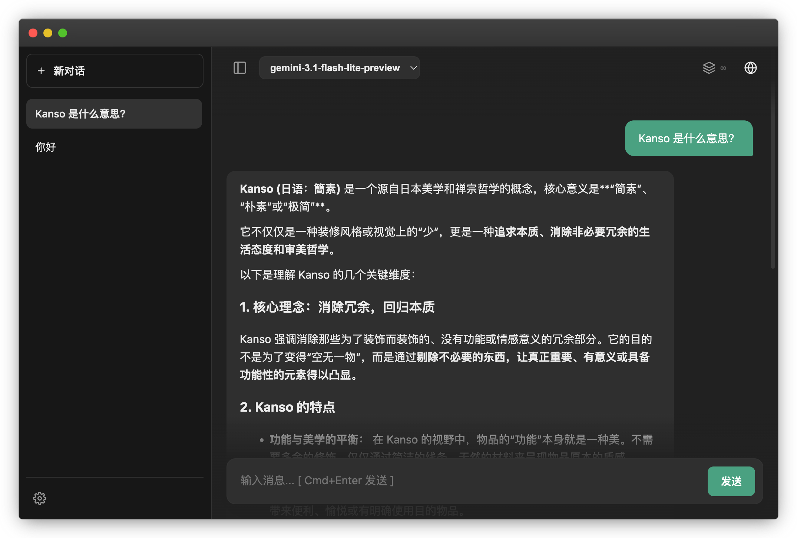

# KansoChat 💬

KansoChat 是一款为深度交流设计的纯前端 AI 对话面板。从支持连发的“并行心流”到精准的上下文控制，每个细节都旨在为你提供一个如流水般顺滑的思维捕捉环境。单文件、零依赖、本地化，无需复杂配置，只需 API Key 即可开始使用。

  
   

## ✨ 核心特性

### 🌊 并行心流

* **思考不打断**：支持问题连发而无需等待，AI 正在生成时你依然可以继续输出，请求自动排队，告别“回完再问”的陈旧交互，对话节奏始终跟得上你的心流。

### 🎭 灵动预设

* **随心调度系统提示词**：独立的系统提示词管理系统，支持**快速编辑**与**一键收藏**。UI 界面提供清晰的预设状态标注，让当前的 AI 角色设定一目了然。

### 🍵 简素即正义

* **零侵入架构、无数据收集**：单文件运行，无数据库，无后端。所有 API Key 与对话历史均加密存储于本地 LocalStorage。
* **干净明晰的视觉风格**：UI 元素精简，界面简洁干净，专注核心交互体验。

### 🍱 其他实用功能

* **精准的上下文控制**：上下文全局滑动条，可直观控制每次提问携带的历史记录条数（0 ~ ∞）。
* **搜索历史**：搜索历史记录功能，支持快速回溯和查看过往查询内容。
* **图片上传**：支持直接从剪贴板粘贴图片至输入框，支持通过右键点击输入框唤起菜单快速上传图片文件。
* **代码块智能处理**：超过 12 行的长代码块默认自动折叠中间部分，并支持单击区域极速复制。

### ⌨️ 快捷键流 · Hotkeys

* **高效快捷键流**：专为高频使用者打磨，双手无需离开键盘：
<ul>
  
| 快捷键 | 功能 |
| :--- | :--- |
| <kbd>Alt</kbd> + <kbd>N</kbd> | 快速新建空对话 |
| <kbd>Alt</kbd> + <kbd>↑</kbd> <kbd>↓</kbd> | 快速切换历史对话 |
| <kbd>Alt</kbd> + <kbd>F</kbd> | 切换沉浸式输入框 |
| <kbd>Ctrl/Cmd</kbd> + <kbd>K</kbd> | 插入/撤销上下文清除线 |
| <kbd>Alt</kbd> + <kbd>1~9</kbd>  | 极速切换自定义的专属模型 |
</ul>
 

## 🌟 快速上手

1. 下载本仓库中的 `Index.html`并打开，或直接点击此页面上方的 Launch App 按钮。
2. 点击左下角 ⚙️ **偏好设置** -> **系统**，填入你的 **Google Gemini API Key**。
3. 开始沉浸式对话。
 

> 日语词语 Kanso (簡素)，指通过剔除冗余、回归本质，来展现事物简约而纯粹的自然之美 🍃
>
> 本项目极度克制（我已经禁食145天！），目前仅适配并支持 Google Gemini API
